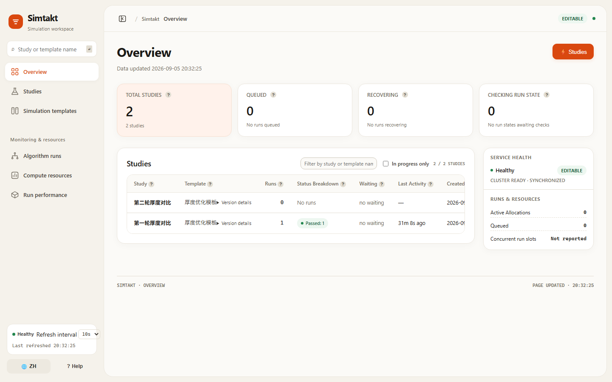
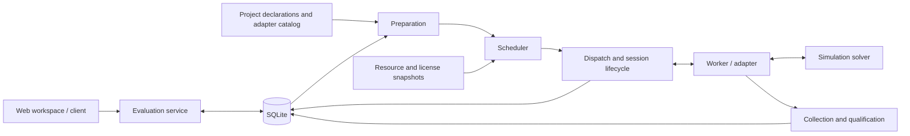

<div align="center">

# Simtakt

**Keep long-running simulations on track. Trace every result to its inputs.**

A simulator-neutral orchestration control plane and research workspace

[](pyproject.toml)
[](docs/ARCHITECTURE.md)
[](LICENSE)

[简体中文](README.md) · **English**

[Quick start](#quick-start) · [Workflow](#workflow) · [Architecture](#architecture-and-integration) · [Development](#development-and-validation)

</div>



<p align="center"><sub>Actual Web interface, captured from a local example project using the minimal test adapter. This is not output from a commercial solver.</sub></p>

## Why Simtakt

When a simulation takes hours, launching a process is only part of the work. Jobs need to wait for compute resources and licenses. Lost connections need investigation. Completed results need to stay attached to the exact inputs that produced them.

Simtakt provides a control layer for that work. Researchers use a browser to manage model files, configure simulation templates, organize studies and submit runs. Developers connect specific solvers through adapters; SQLite stores lifecycle state, scheduling records and result references.

| Capability | What it provides |
| --- | --- |
| **Reusable simulation templates** | Configure parameters, outputs and simulation tools together. Existing studies retain their selected template version. |
| **Durable execution and recovery** | Track sessions, reconcile lost connections and collect late results without accepting the same result twice. |
| **Compute and license coordination** | Select execution options using targets, resource snapshots and scheduling policy. Sessions without confirmed termination remain part of capacity accounting. |
| **Traceable research records** | Keep versioned input and execution references, with inspectable attempts, state transitions and qualification outcomes. |
| **Chinese and English workspace** | Cards, status pills, a collapsible sidebar and a mobile drawer. Internal identifiers and raw data are available in expandable details. |
| **Small deployment footprint** | Python's standard library and SQLite power the core. The frontend uses native JavaScript and CSS, with no build step. |

## Quick start

Use **Python 3.10 or later**. Run these commands from the repository root. Core examples require no commercial solver, database service or frontend dependencies.

```bash
git clone https://github.com/MRXhub/simtakt.git
cd simtakt
python -m control_plane.web.status_server --demo
```

Open **http://127.0.0.1:8321/**. Demo mode uses in-memory sample data, is read-only by default and does not execute real simulations. Press `Ctrl+C` to stop the server.

### Run an evaluation end to end

```bash
python examples/minimal-runtime/run_demo.py
```

This example uses real SQLite storage, runtime composition, preparation, scheduling and qualification with a minimal test adapter. Expected output includes:

```text
evaluation terminal status: qualified
```

Each invocation rebuilds and cleans up the example's own temporary workspace and database. Use it to verify the environment, not to retain research data. See the [minimal runtime example](examples/minimal-runtime/README.md).

### Connect your project

Configure project declarations, execution targets, adapters and scheduling policy as described in the [architecture guide](docs/ARCHITECTURE.md). Then start two processes against the same project root:

```bash
# Terminal 1: process queued evaluations and drive execution sessions
python -m control_plane.runtime --project-root /path/to/project

# Terminal 2: serve the editable Web workspace
python -m control_plane.web.status_server --project-root /path/to/project --allow-writes
```

Replace `/path/to/project` with your directory; quote paths containing spaces. The Web server alone does not execute queued work. Omit `--allow-writes` for read-only access.

The server binds to `127.0.0.1:8321` by default. Write endpoints currently have no built-in authentication. For remote access, use a reverse proxy with authentication and access control.

## Workflow

| Workspace | Your task |
| --- | --- |
| **Model files** | Import simulation inputs, inspect parsing results and save a referenceable file version. |
| **Simulation templates** | Configure parameters, ranges, outputs and a registered simulation tool in one editor. |
| **Studies** | Select a template version and group related runs into a named study. |
| **Submit a run** | Enter parameters, check the run configuration and submit an evaluation request. |
| **Overview and monitoring** | Follow progress, algorithm runs, compute resources and historical run performance. |

The template editor combines the underlying parameter and evaluation definitions into one save action. Routine work does not require separate `Schema` and `Problem` forms. Version identifiers, raw JSON and diagnostics remain available in expandable details.

**Run performance** reports historical execution time, CPU and memory measurements grouped by task class and resource configuration. It is not a geometry, mesh or simulation-result plotting tool. Missing measurements appear as `—`.

## Architecture and integration



Project declarations assemble the runtime. The scheduler selects among prepared options using performance profiles and resource snapshots; the dispatcher persists a claim before starting the session. The control plane handles recovery, termination confirmation and late result collection, while workers and adapters implement solver-specific operations.

An integration requires these declarations and their referenced configuration and implementations:

| File | Purpose |
| --- | --- |
| `project/RUNTIME_COMPONENTS.json` | Worker and resource monitor components, plus the scheduling policy revision. |
| `project/SIMULATION_ADAPTERS.json` | Adapter registrations, supported capabilities and default resource requirements. |
| `project/EXECUTION_TARGETS.json` | Execution targets available for scheduling. |
| `records/artifacts/` | Catalog records for input packages, scheduling policies and other artifacts. |

The repository includes **reference adapters and test doubles** for local processes, batch queues and server sessions. Commercial TCAD, FEM and CFD solvers require their own implemented and validated integration. Current browser end-to-end validation uses the minimal test adapter.

<details>
<summary><strong>Source layout</strong></summary>

| Path | Responsibility |
| --- | --- |
| `control_plane/core/` | Evaluation contracts, validation rules and storage interfaces. |
| `control_plane/evaluation/` | Preparation, scheduling, dispatch, qualification and service APIs. |
| `control_plane/runtime/` | Runtime composition from project declarations and the execution loop. |
| `control_plane/data/` | SQLite persistence and transactional state management. |
| `control_plane/simulation/` | Simulator, worker, gateway and session protocols. |
| `control_plane/web/` | HTTP APIs and the frontend, served without a build step. |
| `examples/` | Runnable examples and adapter references. |
| `tests/` | Python regression tests and browser integration checks. |

</details>

## Development and validation

Run the core suite without a third-party test framework:

```bash
python -m unittest discover tests
```

Optional browser validation requires **Node.js, Playwright and Chrome**:

```bash
npm install --no-save --package-lock=false playwright
node tests/browser_workbench_smoke.cjs
```

The script launches an isolated project and browser. It covers model import, template saves and failure retries, study creation, parameter checks, execution through qualification, persistence after reload, template version isolation, language switching and mobile navigation. Set `PYTHON` to select a Python executable or `BROWSER_CHANNEL` to select an installed browser channel. Reports, screenshots and request records are retained in `tmp/browser-smoke-*` and are excluded from source control.

Local checks before this publication: **441 Python tests, 0 failures, 1 skip; 21 real-browser checks passed**. See the [publication review](docs/PUSH_REVIEW.md) and [browser validation record](docs/BROWSER_FLOW_REVIEW.md) for scope. These checks do not replace integration testing for your solver and deployment environment.

## Documentation and examples

| Guide | Contents |
| --- | --- |
| [Architecture and extension points](docs/ARCHITECTURE.md) | Composition, resource constraints, recovery semantics and interfaces. |
| [Preparation inputs](docs/governed-preparation-inputs.md) | Input sources, version bindings and failure rules. |
| [UI terminology](docs/UI_TERMINOLOGY.md) | Chinese/English naming and technical disclosure conventions. |
| [Minimal runtime](examples/minimal-runtime/README.md) | A complete request-to-qualification example. |
| [Basic local jobs](examples/basic-local/README.md) | Scheduling and session lifecycle without an external solver. |
| [Local process adapter](examples/adapter-local-process/README.md) | A process-based integration reference. |
| [Batch queue adapter](examples/adapter-batch-queue/README.md) | Queue jobs and session recovery. |
| [Server session adapter](examples/adapter-server-session/README.md) | Persistent sessions, reconnection and result collection. |

## Contributing

[Issues](https://github.com/MRXhub/simtakt/issues) and pull requests are welcome. Include reproduction steps, Python version, adapter type and sanitized error details in bug reports. Changes to execution or recovery behavior should include a regression test covering the triggering conditions.

## License and citation

Released under the [MIT License](LICENSE). If you use Simtakt in research, citation metadata is available in [CITATION.cff](CITATION.cff) and GitHub's **Cite this repository** menu.
