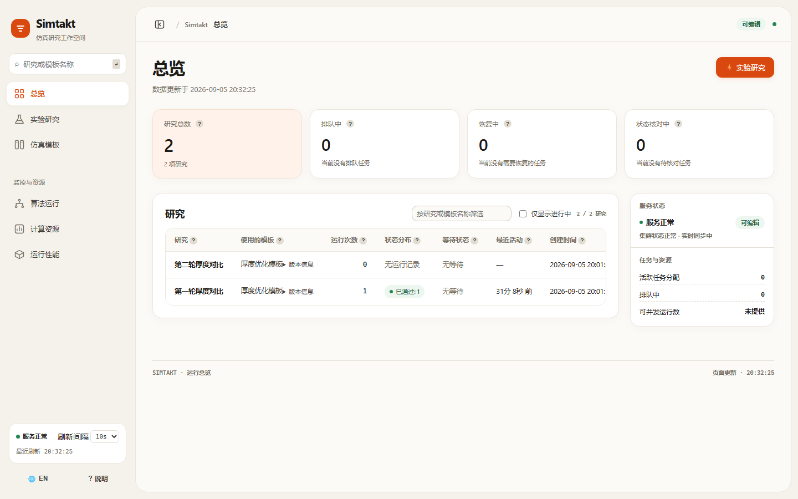
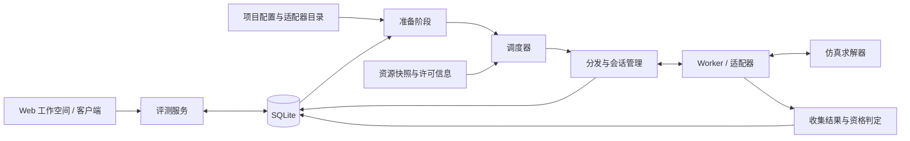

<div align="center">

# Simtakt

**让长时间仿真有序运行，让每一次结果有据可查。**

面向仿真研究的任务编排与运行工作空间

[](pyproject.toml)
[](docs/ARCHITECTURE.md)
[](LICENSE)

**简体中文** · [English](README.en.md)

[快速开始](#快速开始) · [使用流程](#使用流程) · [架构与接入](#架构与接入) · [开发与验证](#开发与验证)

</div>



<p align="center"><sub>实际 Web 界面；截图来自使用最小测试适配器的本地示例项目，不代表商业仿真器的计算结果。</sub></p>

## 它解决什么问题

仿真运行几小时甚至更久时，工作远不止启动一个进程：任务需要排队，计算资源和软件许可需要协调，进程失联后需要确认状态，完成的结果也需要关联到准确的输入版本。

Simtakt 将这些工作集中到一个与仿真器解耦的控制层。研究人员可以在浏览器中管理模型文件、配置仿真模板、创建研究并提交运行；开发者通过适配器连接具体求解器，使用 SQLite 保存任务状态、调度记录与结果引用。

| 能力 | 带来的变化 |
| --- | --- |
| **可复用的仿真模板** | 将参数、输出项和仿真工具放在同一处配置；历史研究保留原有模板版本。 |
| **持续运行与故障恢复** | 跟踪执行会话，核对失联任务，处理延迟返回的结果，避免重复接收同一结果。 |
| **资源与许可协调** | 根据执行节点、资源快照和调度策略选择运行方案；未确认结束的会话继续参与容量核算。 |
| **可追溯的研究记录** | 输入与执行配置按版本引用；运行状态、执行尝试和结果判定可以追查。 |
| **中英文工作空间** | 卡片式布局、状态标签、可收起侧栏与移动端抽屉；内部标识和原始数据按需展开。 |
| **轻量部署** | Python 标准库与 SQLite 支撑核心运行；前端采用原生 JavaScript 和 CSS，无需构建。 |

## 快速开始

需要 **Python 3.10 或更高版本**。从仓库根目录执行以下命令；核心示例不需要安装商业求解器、数据库服务或前端依赖。

```bash
git clone https://github.com/MRXhub/simtakt.git
cd simtakt
python -m control_plane.web.status_server --demo
```

打开 **http://127.0.0.1:8321/** 查看演示工作空间。该模式使用内存示例数据，默认只读，不会执行真实仿真。按 `Ctrl+C` 停止服务。

### 跑通一次完整评测

```bash
python examples/minimal-runtime/run_demo.py
```

该示例使用真实 SQLite、运行时组装、准备阶段、调度器和结果判定流程，配合最小测试适配器。预期输出包含：

```text
evaluation terminal status: qualified
```

示例每次重建并在退出时清理自身目录下的临时工作区和数据库，适合验证环境，不用于保存研究数据。详见[最小运行时示例](examples/minimal-runtime/README.md)。

### 连接自己的项目

先按[架构文档](docs/ARCHITECTURE.md)配置项目声明、执行节点、适配器及调度策略，再启动两个进程，使用相同的项目根目录：

```bash
# 终端 1：处理排队任务并驱动执行会话
python -m control_plane.runtime --project-root /path/to/project

# 终端 2：提供可编辑的 Web 工作空间
python -m control_plane.web.status_server --project-root /path/to/project --allow-writes
```

将 `/path/to/project` 替换为实际目录，路径含空格时加引号。仅启动 Web 服务不会执行排队任务；省略 `--allow-writes` 可提供只读查看。

Web 服务默认监听 `127.0.0.1:8321`。写接口目前不提供内置身份认证；需要远程访问时，应通过有身份认证和访问控制的反向代理提供服务。

需要容器部署或接入仿真服务器时，请阅读 [Docker 部署](docs/DOCKER.md)、[仿真端 SSH 接入](docs/SSH_SIMULATION.md)与 [adapter 开发规范](docs/ADAPTERS.md)。

## 使用流程

| 工作区 | 你在这里做什么 |
| --- | --- |
| **模型文件** | 导入仿真输入文件，检查解析结果，并保存可引用的文件版本。 |
| **仿真模板** | 统一设置参数、取值范围、输出项与已配置的仿真工具，保存为可复用模板。 |
| **实验研究** | 选择模板及版本，为一组相关运行创建研究。 |
| **提交运行** | 填写参数，检查运行配置，再提交评测请求。 |
| **总览与监控** | 查看任务进展、算法运行、计算资源和历史运行性能。 |

模板编辑器将底层参数定义与评测定义整合为一次保存操作。日常使用无需分别处理 `Schema` 和 `Problem`；版本标识、原始 JSON 与诊断信息仍可在详情中展开查看。

**运行性能 / Run performance** 展示历史执行的耗时、CPU 与内存等统计，按任务类别和资源配置分组。它不是几何建模、网格编辑或仿真结果绘图工具；缺失的测量值显示为 `—`。

## 架构与接入



运行时由项目声明组装。调度器根据已准备的候选方案、性能画像和资源快照做出决策，分发器在启动会话前持久化领取记录。会话恢复、终止确认和延迟结果接收由控制层负责，具体求解器操作由 Worker 与适配器实现。

接入项目至少需要下列声明及其引用的配置与实现：

| 文件 | 用途 |
| --- | --- |
| `project/RUNTIME_COMPONENTS.json` | 声明 Worker、资源监测组件，以及调度策略版本。 |
| `project/SIMULATION_ADAPTERS.json` | 注册适配器、支持的能力和默认资源要求。 |
| `project/EXECUTION_TARGETS.json` | 声明可供调度的执行节点。 |
| `records/artifacts/` | 保存输入包、调度策略等工件的目录记录。 |

仓库包含本地进程、批处理队列和服务端会话的**参考适配器与测试替身**。商业 TCAD、FEM、CFD 等求解器需要实现并验证相应接入；当前浏览器端到端验证使用最小测试适配器。

<details>
<summary><strong>源码目录</strong></summary>

| 路径 | 职责 |
| --- | --- |
| `control_plane/core/` | 评测契约、校验规则与存储接口。 |
| `control_plane/evaluation/` | 准备、调度、分发、结果判定与服务接口。 |
| `control_plane/runtime/` | 根据项目声明组装组件并执行运行循环。 |
| `control_plane/data/` | SQLite 持久化与事务状态管理。 |
| `control_plane/simulation/` | 仿真器、Worker、Gateway 与会话协议。 |
| `control_plane/web/` | HTTP 接口与无需构建的 Web 工作空间。 |
| `examples/` | 可运行示例与适配器参考实现。 |
| `tests/` | Python 回归测试与浏览器全流程验证。 |

</details>

## 开发与验证

核心回归测试无需第三方测试框架：

```bash
python -m unittest discover tests
```

可选的浏览器验证需要 **Node.js、Playwright 和 Chrome**：

```bash
npm install --no-save --package-lock=false playwright
node tests/browser_workbench_smoke.cjs
```

脚本启动隔离的测试项目和浏览器，覆盖模型导入、模板保存及失败重试、研究创建、参数检查、运行至结果判定、刷新后持久化、模板版本隔离、中英文切换和移动端导航。可用环境变量 `PYTHON` 指定 Python 可执行文件、`BROWSER_CHANNEL` 指定已安装的浏览器通道。报告、截图和请求记录保存在 `tmp/browser-smoke-*`，不随源码提交。

## 文档与示例

| 入口 | 内容 |
| --- | --- |
| [Docker 部署](docs/DOCKER.md) | 镜像构建、演示与项目模式、持久化和扩展加载。 |
| [仿真端 SSH 接入](docs/SSH_SIMULATION.md) | OpenSSH 格式、凭据挂载、节点映射与会话恢复约定。 |
| [Adapter 开发与注册](docs/ADAPTERS.md) | 工厂入口、项目 JSON、Worker 与结果接口。 |
| [架构与扩展](docs/ARCHITECTURE.md) | 运行时组装、资源约束、恢复语义与扩展接口。 |
| [准备阶段输入](docs/governed-preparation-inputs.md) | 输入来源、版本绑定及失败规则。 |
| [中英文术语](docs/UI_TERMINOLOGY.md) | 用户界面命名、技术信息展示规则。 |
| [最小运行时](examples/minimal-runtime/README.md) | 从请求提交到结果判定的完整示例。 |
| [本地短任务](examples/basic-local/README.md) | 无外部求解器的调度与会话流程。 |
| [本地进程适配器](examples/adapter-local-process/README.md) | 基于进程的接入参考。 |
| [批处理队列适配器](examples/adapter-batch-queue/README.md) | 队列任务与会话恢复参考。 |
| [服务端会话适配器](examples/adapter-server-session/README.md) | 持久会话、重连与结果收集参考。 |

## 参与项目

欢迎提交 [Issue](https://github.com/MRXhub/simtakt/issues) 或 Pull Request。报告问题时请附上复现步骤、Python 版本、适配器类型，以及去除敏感内容的错误信息。修改执行或恢复逻辑时，请一并提供能覆盖触发条件的回归测试。

## 许可证与引用

项目使用 [MIT 许可证](LICENSE)。在研究中使用本项目时，可通过 [CITATION.cff](CITATION.cff) 或 GitHub 的 **Cite this repository** 入口引用。
